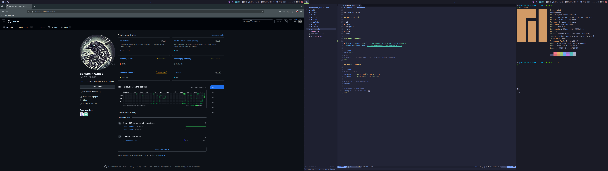

# Personnal dotfiles



## Get started

- i3
- urxvt
- polybar
- nvim
- code 
- rofi

### Requirements

- [JetBrainsMono Font](https://www.jetbrains.com/lp/mono/)
- [FontAwesome6 Free](https://fontawesome.com/download)

```bash 
make install
make i3
# restart i3 with shortcut (default $mod+Shift+r)
```

## Miscallaneous

```bash 
# pulseaudio
systemctl --user enable pulseaudio
systemctl --user start pulseaudio

# monitos identification
xrandr

# window properties
xprop # + clic on window
```
